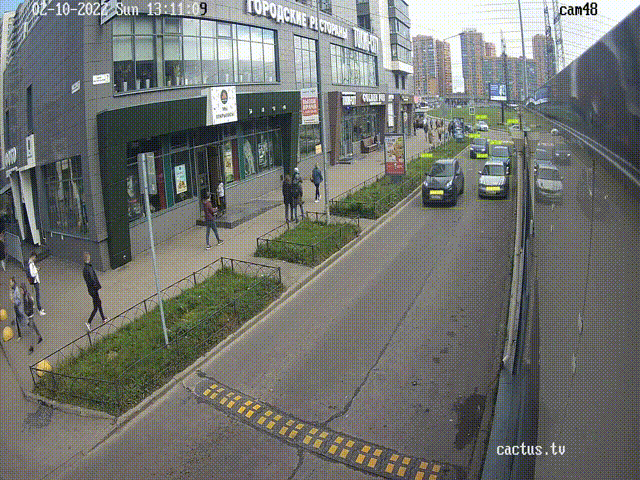
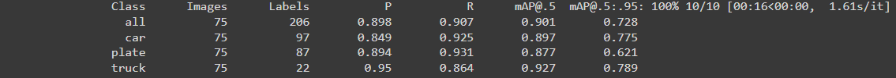
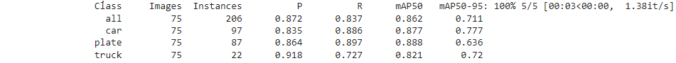
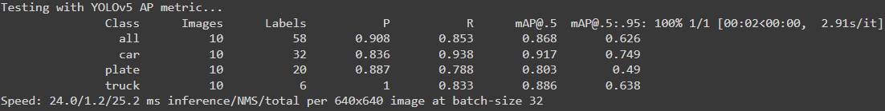
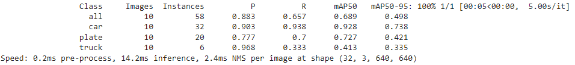

### Цель проекта:
Данный проект учебный, необходимо создать и обучить модель для распознавания номера и типа машины в видеопотоке, полученном с видеокамеры на КПП

### Результат:

### Шаги реализации:
1) Датасет содержит три класса(легковая машина, номер, грузовая машина), собрали его из трех частей: 
* скриншоты с камер видеонаблюдения
* скаченные картинки с интернета, для обогащения класса **грузовая машина**
* скаченный готовый датасет из [kaggle](https://www.kaggle.com/datasets/andrewmvd/car-plate-detection)

Произвели разметку классов для Yolo моделей при помощи labelImg.

2) Обучили на собранном [датасете](https://www.kaggle.com/datasets/kirillpribludenko/number-plates-50-russain-50-others) две модели [Yolov5m](yolov5m.ipynb) и [Yolov7](ALPR.ipynb). 

Лучшие веса для данных моделей:
[Yolov5m](https://drive.google.com/file/d/1htNcnFONfzpevnFL5iw3OpycEK3tG71m/view?usp=sharing)
[Yolov7](https://drive.google.com/file/d/1e5QTOn7kLk5ekQHyR8343c90Hhw3FAEy/view?usp=sharing)

Произвели сравнение по метрикам Precision, Recall и mAP результатов детекций, чтобы выяснить какая из моделей лучше подходит для данной задачи

**Метрики качества валидационного набора для Yolov7:**

**Метрики качества валидационного набора для Yolov5m:**

**Метрики скорости тестового набора для Yolov7 (дополнительно был поставлен флаг --v5-metric):**

**Метрики скорости тестового набора для Yolov5m:**

На основани полученных результатов была выбрана модель Yolov7.

Замеры производились с помощью графической карты Tesla T4

3) В код модели добавили автоматическое распознавание текста при детекции номера, реализованное через easyocr
